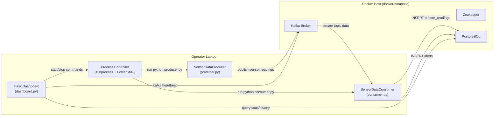
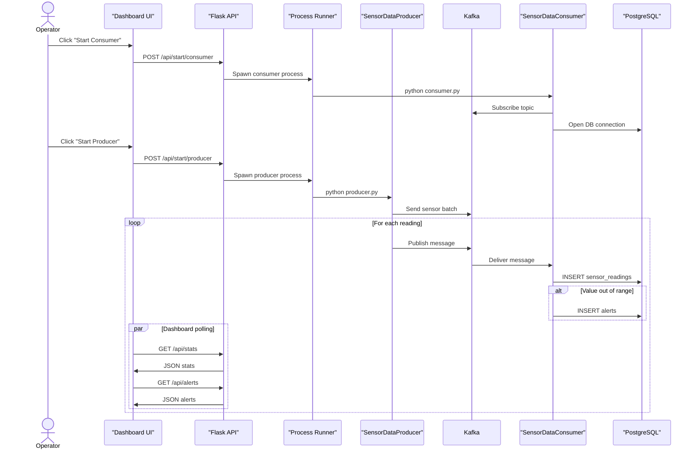
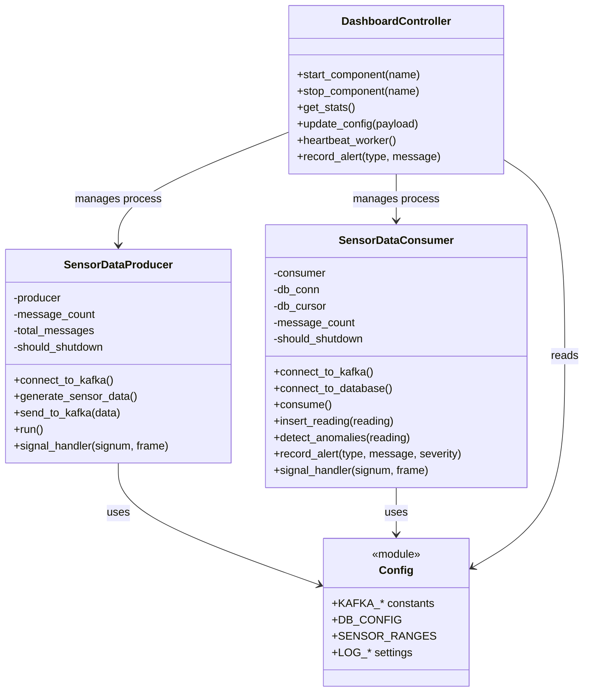
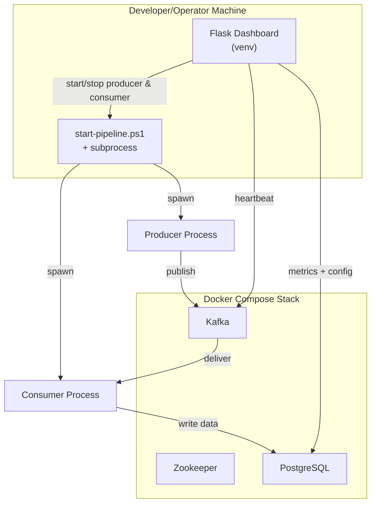
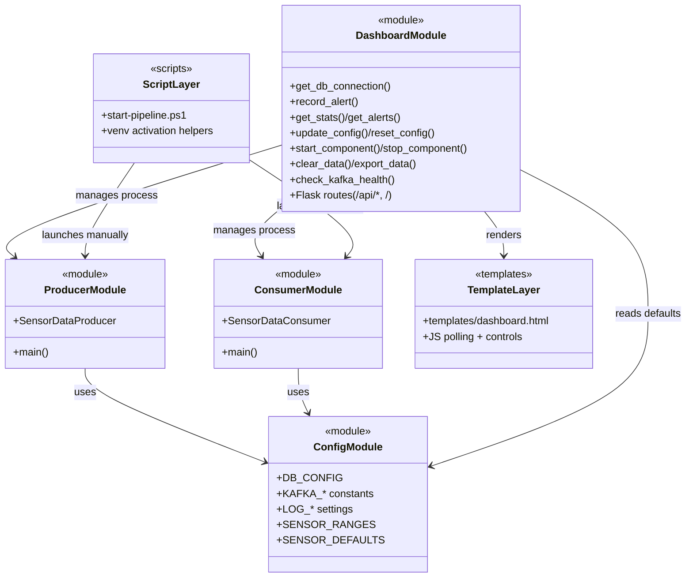

# UML Diagram Pack

Comprehensive UML views of the sensor pipeline. Paste the diagrams into any Mermaid-compatible viewer (e.g., VS Code Mermaid extension, mermaid.live) to render them. Each section highlights a different concern: structure, runtime flow, classes, and deployment.

---

## 1. Component Diagram

---

## 2. Sequence Diagram (Start + Data Flow)

---

## 3. Class Diagram (Core Python Types)

---

## 4. Deployment Diagram

---

## 5. Code Structure Diagram

High-level view of the modules and the main entry points/functions exposed by each file.

Use this diagram alongside the others for a complete picture of how every module fits into the project.

Render the diagrams with any Mermaid tool or integrate them into existing docs as-needed.
